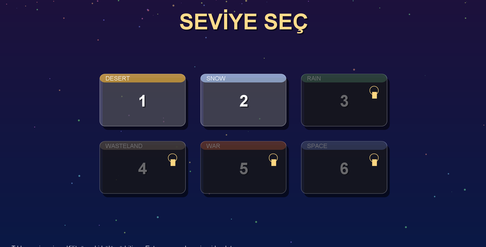
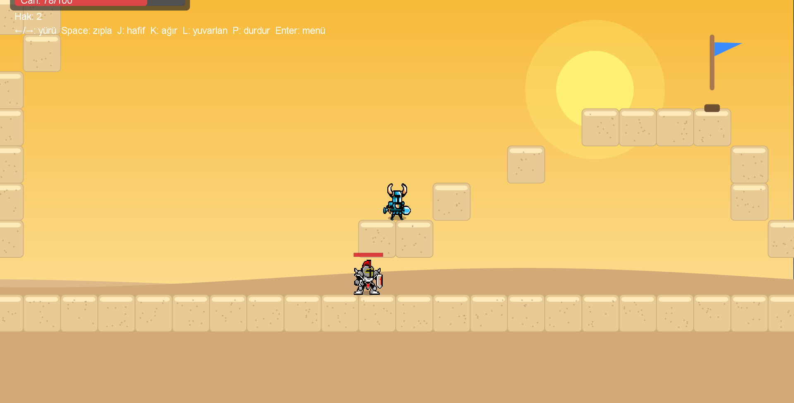
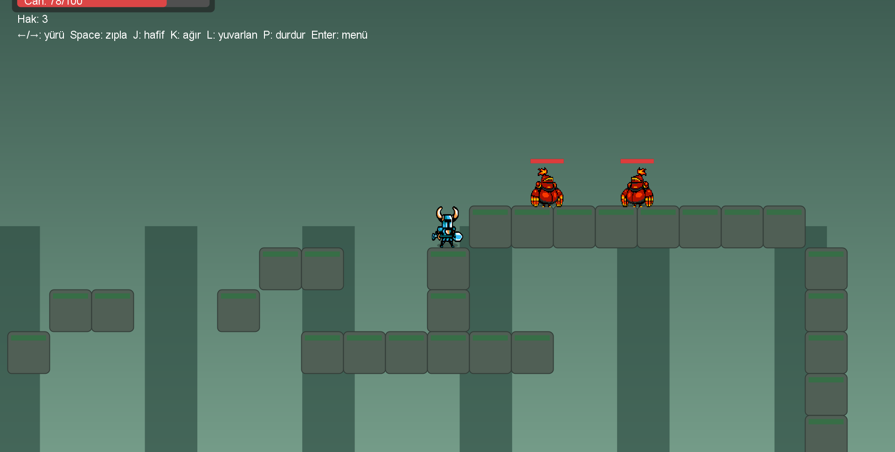
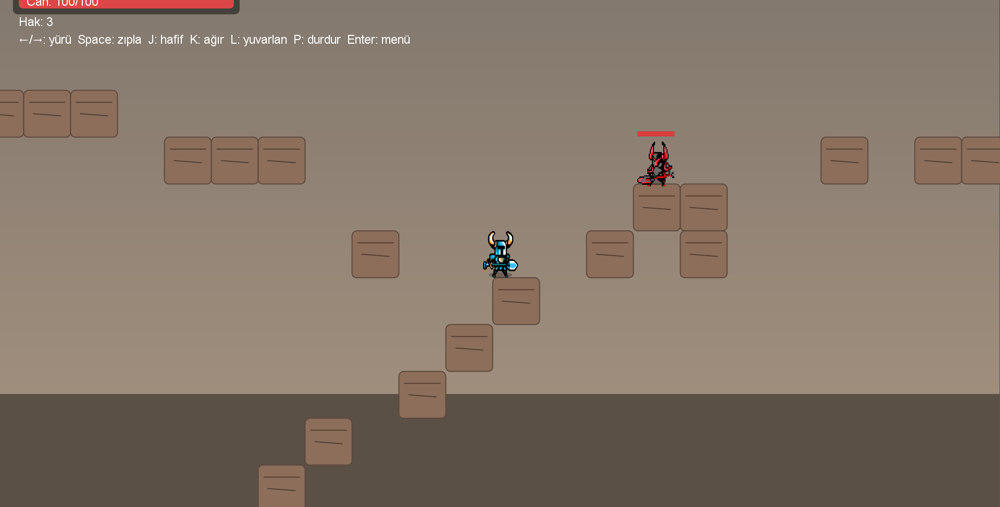
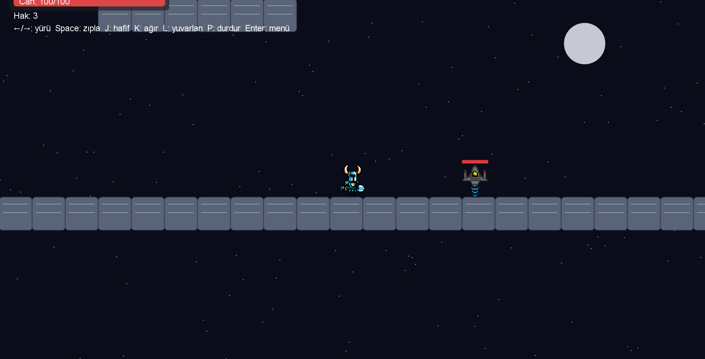

Knight Platformer

Knight Platformer is a 2D side-scrolling action platformer developed with Java Swing.
The player controls a knight who must fight enemies, overcome hazards, and reach the goal across six different themed levels.

Features

Six unique themes: Desert, Snow, Rain, Wasteland, War, and Space

Combat system with light and heavy attacks, rolling, and knockback

Enemy AI with multiple types such as Swordsman, Spearman, Brute, and Drone

Checkpoint and life system for fair progression

Particle effects for weather and combat feedback

Fullscreen scaling that adapts to any screen resolution

Level select menu with unlock progression

Controls
Left / Right or A / D : Move
Space : Jump
J : Light attack
K : Heavy attack
L : Roll
P : Pause
Enter : Return to level select

Building and Running

Make sure Java 8 or newer is installed.

Compile the sources:
javac -d out src/*.java

Package into a jar:
jar cfe KnightPlatformer.jar Main -C out .

Run the game:
java -jar KnightPlatformer.jar

Project Structure
GamePanel.java - main game loop, rendering, and updates
Player.java - player logic, movement, combat
Enemy.java and subclasses - enemy AI and behaviors
Level.java - level design and world building
Art.java - rendering utilities and sprites
Rect.java, Point.java - helper classes

License
This project is created for learning and personal use. You are free to modify and extend it for non-commercial purposes.
